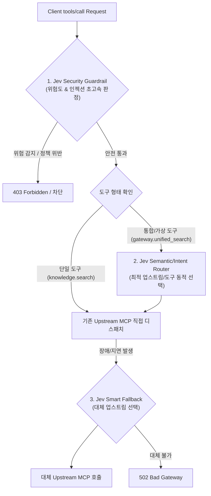

# Tools Gateway: Jev 기반 지능형 라우팅 및 가드레일 도입 조사 보고서

## 1. 개요 및 배경

Tools Gateway는 클라이언트(AI 에이전트 Pod 등)와 여러 업스트림 MCP(Model Context Protocol) 서버 사이에서 정책 검증, 자격증명 교환, 도구 통합 노출을 담당하는 게이트웨이 서비스입니다.

현재 라우팅 구조는 `toolPrefix.toolName` 형태의 명시적 네임스페이스 매핑 및 정적 정규식 기반 정책(`toolPolicy.allow/deny`, `ToolAccessPolicy`)에 의존하고 있습니다. 본 문서는 사용자 요청 이후 라우팅 단계에 **TypeSafe의 System One 결정 엔진인 Jev**를 도입할 수 있는 기술적 타당성, 아키텍처 옵션, 기대 효과 및 한계점을 분석합니다.

---

## 2. Jev 기술 스펙 요약

- **핵심 개념**: TypeSafe System One 초고속 확률 결정 엔진 ([typesafe.ai](https://typesafe.ai)).
- **동작 특성**:
  - 텍스트 생성(Generative Output) 없이, 주어진 입력 상태(State/Context)에 대해 미리 정의된 Typed Questions(카테고리 선택, Boolean 확률, 점수/평가)를 단일 병렬 호출로 밀리초(ms) 단위로 평가.
  - 확신도(Confidence/Calibrated Probability)를 함께 반환하여 임계값 기반 의사결정 가능.
- **Node.js/TypeScript 연동**:
  - TypeSafe REST API 또는 Node.js 클라이언트(`@mlola/decision-jev`, `@patdown/jev`) 활용.

---

## 3. Tools Gateway 현재 구조 vs Jev 적용 지점 분석

### 3.1 현재 라우팅 및 실행 파이프라인
1. 클라이언트가 HTTP POST `/mcp`로 `tools/call` 요청 발송 (호출 대상 도구명: 예 `knowledge.search`).
2. `ToolRouteMap`에서 `knowledge` prefix를 조회하여 해당 `UpstreamConnection` 획득.
3. `ToolArgumentSanitizer` 및 `OutboundSecretLeakGuard`를 통한 정적 보안 검증.
4. `ToolAccessPolicy`를 통한 RBAC/스코프 검증.
5. 대상 업스트림 MCP로 요청 프록시 및 결과 반환 후 출력 마스킹(`sanitizeToolResult`).

### 3.2 Jev 적용 가능한 3대 영역

#### 영역 1: 지능형 보안 정책 가드레일 (Smart Security Guardrail)
- **위치**: `createGatewayServer.ts` 내 도구 실행 직전.
- **역할**: 정규식 기반 정적 탐지를 보완하여 프롬프트 인젝션 의심도, 시스템 명령어 악용 의심도, 권한 상승 시도 여부를 초고속 평가.
- **장점**: 룰셋을 우회하는 변형 공격 패턴을 적은 지연시간(수십 ms)으로 효과적으로 사전 차단.

#### 영역 2: 가상 메타 도구의 시맨틱 라우팅 (Smart Virtual Tool Routing)
- **위치**: 상위 수준의 통합 도구(예: `gateway.search`, `gateway.fetch_context`) 처리 시.
- **역할**: 여러 업스트림 도구(Knowledge, GitHub, Context7, Local Docs 등) 중 사용자의 질의 의도와 파라미터에 가장 적합한 업스트림 도구를 Jev가 동적으로 판정하여 전달.
- **장점**: 에이전트의 복잡한 도구 선택 부하를 게이트웨이가 대신 처리하여 토큰 소모 감소 및 정확도 향상.

#### 영역 3: 상황 적응형 스마트 폴백 (Smart Dynamic Fallback)
- **위치**: 회로 차단기(Circuit Breaker) 및 오류 처리 레이어.
- **역할**: 특정 업스트림이 일시적 타임아웃이나 오류를 낼 때, 단순히 에러를 리턴하는 대신 유사한 기능을 제공하는 예비 업스트림으로 요청을 스마트하게 전환.

---

## 4. 제약 사항 및 고려 요소

1. **MCP 프로토콜 제약**:
   - 순수 프록시 관점에서 MCP 클라이언트는 구체적인 `prefix.name`을 이미 지정해 요청하므로, 게이트웨이가 라우팅 대상을 임의 변경하면 클라이언트가 기대한 스키마와 불일치할 수 있음.
   - 따라서 라우팅은 **새로운 통합 도구(Virtual Tool)**로 정의하거나 **폴백/미러링** 목적으로 한정하는 것이 적합함.
2. **지연 시간(Latency) 관리**:
   - 인메모리 라우팅(0.01ms) 대비 Jev 네트워크 호출(20~50ms)의 오버헤드 발생.
   - Redis 캐싱 및 타임아웃(예: 100ms) 설정 후 초과 시 기존 정적 룰로 패스스루하는 Fail-Open / Fail-Safe 전략 필수.
3. **TypeScript/Node.js 호환성**:
   - 공식 SDK 및 REST 엔드포인트를 래핑하는 전용 TypeScript 클라이언트 서비스 계층 구현 필요.

---

## 5. 결론 및 권고안

Jev는 초고속 단일 패스 분류/확률 판정에 특화되어 있어 Tools Gateway에 매우 유용한 도구입니다. 단, 기존 정적 라우팅을 전면 대체하기보다는 **1단계: 인자 지능형 가드레일(AI Guardrail)**, **2단계: 가상 메타 도구 라우팅(Virtual Dispatcher)** 형태로 점진적 도입하는 것을 권장합니다.
